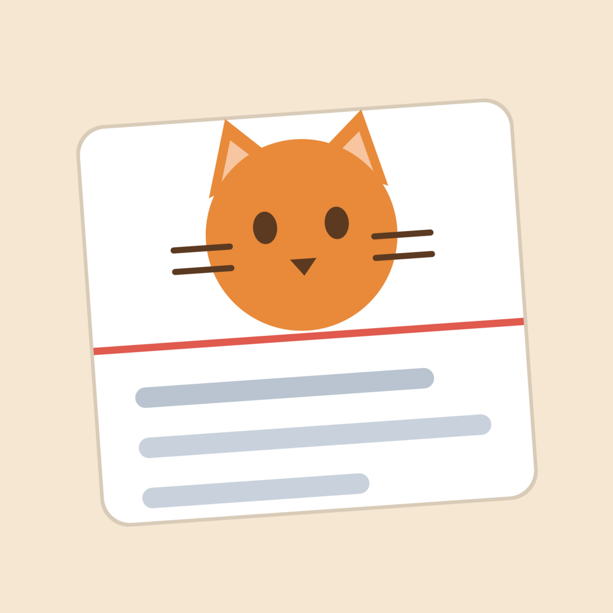
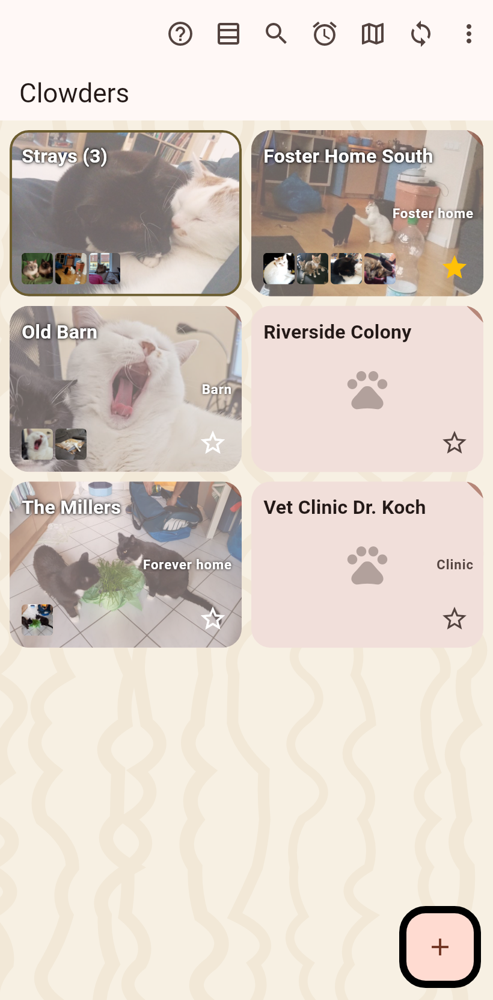
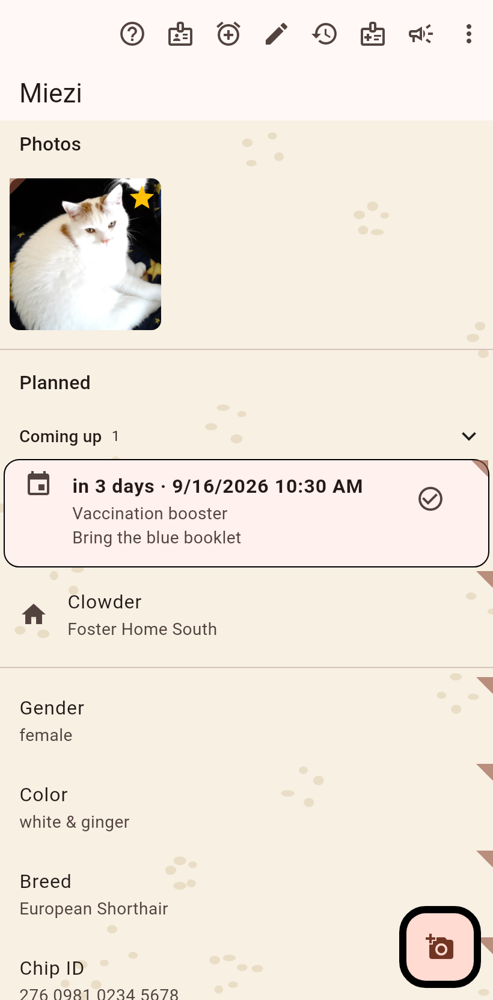
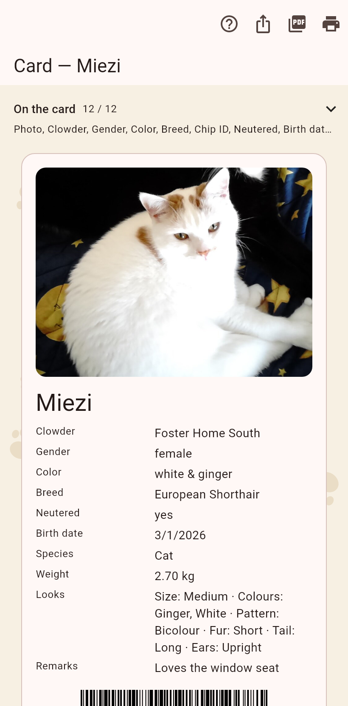
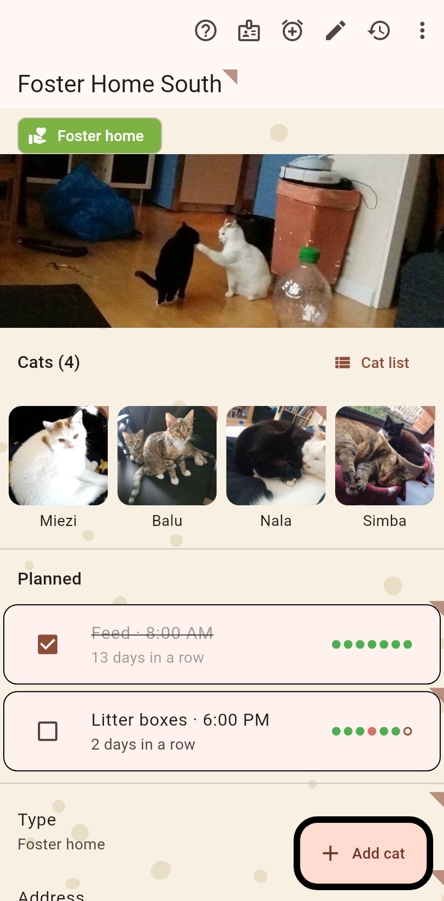
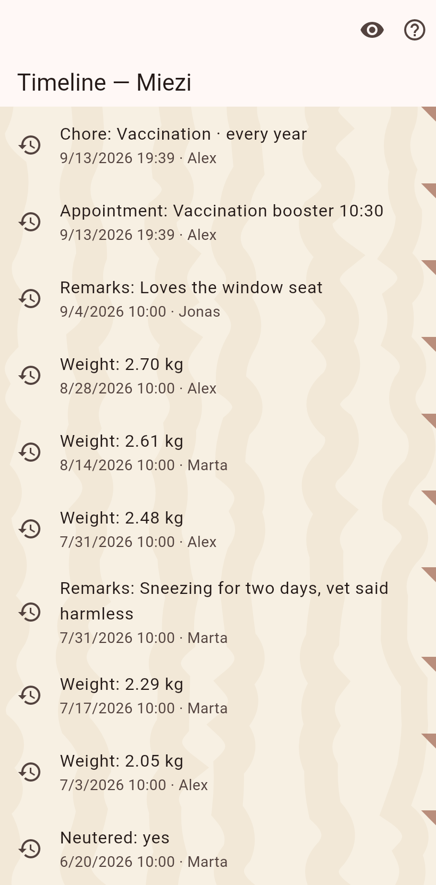
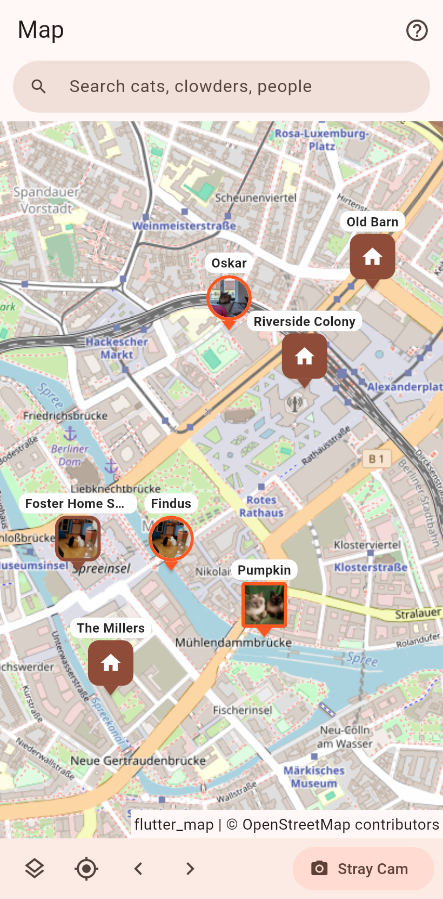

  

<h1 align="center">cat(a)log</h1>

  <b>The app for people who foster cats.</b> 
  Everything stays on your phone — no account, no cloud, no tracking. Free.

---

Ten foster kittens that all look the same. Who is who? Who is already
neutered? When was Luna spayed, and where did Miezi end up after adoption?

cat(a)log keeps a **card for every cat** — photo, gender, color, whatever you
want to note — and remembers **when everything happened**. Nothing you write
down ever gets lost: every change keeps its date and the name of the person
who made it, and you can look at any cat's story like a diary.

## What it does

- **Cards** — one page per cat with photo and facts. Send it to an adopter
  as a picture, or print it for the vet's notice board.
- **Homes for cats** — cats live in groups the app calls *clowders* (that's
  the real English word for a group of cats!): your foster home, an
  adopter's flat, the barn next door. Moving a cat to its new family is two
  taps — and the app remembers the move forever.
- **The diary** — tap the clock on any cat: every change, every move, every
  vet date, in order. Made a mistake? Undo it — the correction is written
  into the diary too, nothing is ever erased in secret.
- **Street cats** — cats without a home appear on a map. See a stray? One
  tap on the Stray Cam saves it right where you stand, photo included. Meet
  it again elsewhere? The map shows where it wanders.
- **Photos of a whole litter?** Crop the right kitten out when you add the
  photo, or draw a circle around it when they're too tangled to crop.
- **Share with your helpers** — your phone and a friend's phone swap their
  data directly over your Wi-Fi, or through a shared folder (Dropbox, Google
  Drive, a USB stick — whatever you already use). No company server ever
  sees your cats. If two of you changed the same thing at the same time, the
  app shows both versions and you pick what's right.
- **Your own fields** — want to track "flea treatment" or "favorite food"?
  Add it yourself; it works like everything else, diary included.
- **Speaks your language** — 38 languages, including Arabic, Farsi, and
  Hebrew written right-to-left. (The translations are computer-made — tell
  us where they sound wrong!)

## What it looks like

| Home | A cat | Its card |
|---|---|---|
|  |  |  |

| A foster home | The diary | The map |
|---|---|---|
|  |  |  |

*(Demo data — the cats in your catalog will be considerably fluffier.)*

## Get it

Everything is on the **[download page](https://github.com/paxel/catlog/releases)**.

- **Android phone or tablet**: download the file ending in
  `arm64-v8a.apk`, open it, and allow the installation when the phone asks.
- **iPhone / iPad**: currently as a beta through Apple's TestFlight —
  [ask us](https://github.com/paxel/catlog/issues) and we'll invite you.
- **Windows**: download the file ending in `windows-x86_64.zip`, unpack it
  anywhere, double-click `catlog.exe`.
- **Mac**: download the `.dmg` for your Mac (`arm64` for newer Macs,
  `x86_64` for Intel ones), drag the app into Applications. The first time,
  **right-click the app and choose "Open"** — it isn't signed with Apple,
  so the Mac asks once.
- **Linux**: download the `tar.gz`, unpack, run `catlog`.

Your data never leaves your devices unless *you* share it. There is nothing
to sign up for and nothing to pay. If the app helps you and you feel like
it, you can buy the developer a coffee — the button is on the About page in
the app.

## Questions, problems, ideas

Write us: [github.com/paxel/catlog/issues](https://github.com/paxel/catlog/issues)
— in whatever language you like.

---

*For developers: build instructions, architecture, and release process live
in [docs/DEVELOPMENT.md](docs/DEVELOPMENT.md). The app is open source,
dual-licensed Apache-2.0 / MIT.*
